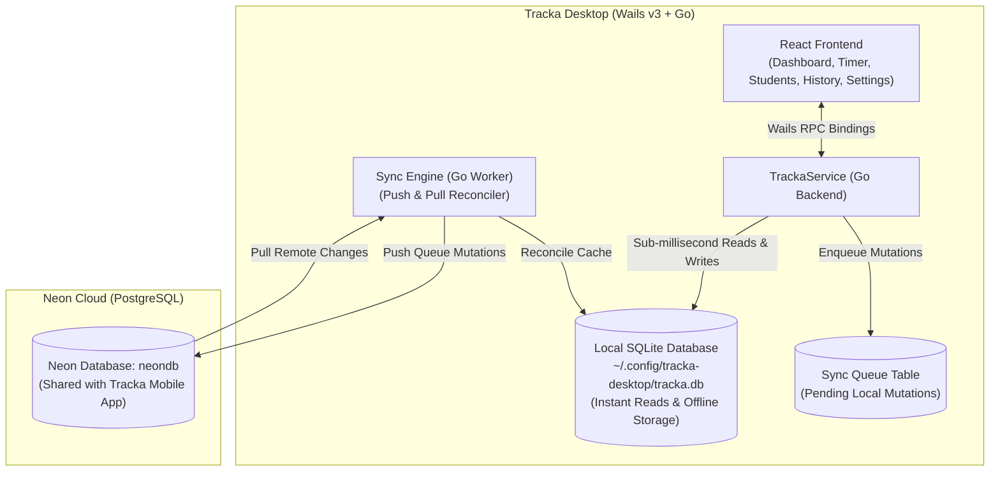

# Tracka Desktop: Offline-First Caching & Neon Cloud Sync Architecture

Bring the new offline-first local caching and bidirectional Neon Postgres synchronization architecture established in `tracka-app` to `tracka-desktop`.

## Architecture Overview



### Problem Statement
Currently, `tracka-desktop` connects directly to Neon Postgres over TCP (`pgx/v5`). This introduces three critical shortcomings:
1. **No Offline Support**: If the tutor opens the app without internet or with spotty connection, the application crashes on startup (`log.Fatalf`) or fails to execute any operation.
2. **Network Latency on UI Operations**: Every screen switch, student list load, and timer tick requires round-trip network queries to AWS/Neon servers.
3. **Architectural Asymmetry**: `tracka-app` (mobile) now features an offline-first architecture with local SQLite caching and background Neon synchronization. The desktop version should match this identical design.

---

## User Review Required

> [!IMPORTANT]
> **Pure-Go SQLite Driver (`modernc.org/sqlite`)**:
> - We will add `modernc.org/sqlite` to `tracka-desktop/go.mod`.
> - This is a pure-Go SQLite driver that compiles without external C libraries (CGo-free SQLite), keeping cross-compilation and desktop packaging clean.

> [!NOTE]
> **Graceful Non-Blocking Startup**:
> - The app will no longer crash (`log.Fatal`) if `DATABASE_URL` is unset or if Neon is unreachable.
> - Instead, the desktop window will open immediately from local SQLite cache (`~/.config/tracka-desktop/tracka.db`).
> - If `DATABASE_URL` is configured and network is available, it syncs in the background and displays "Synced with Neon". If offline, it indicates "Offline · N changes pending".

---

## Proposed Changes

### 1. Go Dependencies & SQLite Driver

#### [MODIFY] [tracka-desktop/go.mod](file:///home/mich/Projects/tracka-desktop/go.mod)
- Add `modernc.org/sqlite` to dependencies.

---

### 2. Database Layer & Migrations

#### [MODIFY] [tracka-desktop/db.go](file:///home/mich/Projects/tracka-desktop/db.go)
- Add SQLite database initialization and migration runner:
  - Database file location: `$XDG_CONFIG_HOME/tracka-desktop/tracka.db`.
  - Enforce `PRAGMA foreign_keys = ON; PRAGMA journal_mode = WAL;`.
  - Migrations:
    - Version 1: `students`, `sessions`, `meta` tables with constraints.
    - Version 2: `group_id` column, `one_running_per_student` index, single running group trigger.
    - Version 3: `sync_queue` table with timestamp index.
- Keep `pgOpenDB` and `pgRunMigrations` for Neon cloud database interactions.

---

### 3. Sync Engine (Go Backend)

#### [NEW] [tracka-desktop/sync.go](file:///home/mich/Projects/tracka-desktop/sync.go)
- Implement Go sync engine mirroring mobile:
  - `enqueueSync(txOrDB, action, entityID, payload)`: Enqueue local mutation and launch non-blocking background sync goroutine.
  - `pushPending(localDB, cloudDB)`: Drain `sync_queue` and apply updates to Neon Postgres using `ON CONFLICT (id) DO UPDATE ...` and `DELETE`.
  - `pullChanges(localDB, cloudDB, sinceOverride)`: Query remote rows updated since `last_synced_to_neon_at` and upsert into local SQLite.
  - `SyncNow()`: Coalesces concurrent sync calls, checks Neon ping, runs push and pull, and emits state change.
  - `GetSyncStatus()`: Returns live sync state (`"synced" | "syncing" | "offline" | "error"`), pending count, and `lastSyncAt`.

---

### 4. Domain Models & Service Layer

#### [MODIFY] [tracka-desktop/models.go](file:///home/mich/Projects/tracka-desktop/models.go)
- Add sync data models:
  ```go
  type SyncStatus struct {
      State        string `json:"state"` // synced | syncing | offline | error
      PendingCount int    `json:"pendingCount"`
      LastSyncAt   *int64 `json:"lastSyncAt"`
      Error        string `json:"error,omitempty"`
  }
  ```

#### [MODIFY] [tracka-desktop/tracka.go](file:///home/mich/Projects/tracka-desktop/tracka.go)
- Refactor `TrackaService`:
  - Holds `localDB *sql.DB` (primary store for all reads and writes) and `cloudDB *sql.DB` (for synchronization).
  - All read methods (`ListStudents`, `GetStudent`, `GetRunningGroup`, `GetSession`, `ListSessions`, `GetDashboard`, `GetLifetime`, etc.) query `localDB` with instant <1ms response.
  - All write methods (`CreateStudent`, `UpdateStudent`, `StartTimer`, `StopTimer`, `LogManualGroup`, etc.) write to `localDB` inside a transaction and call `enqueueSync()`.
  - Add exposed Wails methods:
    - `SyncNow() (bool, error)`
    - `GetSyncStatus() (SyncStatus, error)`
  - Update `StartupCheck()` to report local DB integrity, running session status, AND Neon connection/sync state.

#### [MODIFY] [tracka-desktop/main.go](file:///home/mich/Projects/tracka-desktop/main.go)
- Open and migrate local SQLite database on launch.
- Non-blocking cloud connection: If `DATABASE_URL` is present, attempt Neon connection and start background sync in a goroutine without delaying or aborting window display.

---

### 5. Desktop Frontend (React + Wails)

#### [MODIFY] [tracka-desktop/frontend/src/lib/types.ts](file:///home/mich/Projects/tracka-desktop/frontend/src/lib/types.ts)
- Add `SyncStatus` interface.

#### [MODIFY] [tracka-desktop/frontend/src/lib/api.ts](file:///home/mich/Projects/tracka-desktop/frontend/src/lib/api.ts)
- Bind `api.syncNow()` and `api.getSyncStatus()`.

#### [MODIFY] [tracka-desktop/frontend/src/views/Settings.tsx](file:///home/mich/Projects/tracka-desktop/frontend/src/views/Settings.tsx)
- Add **Neon Cloud Sync** card matching the mobile UI:
  - Display current sync status: "Synced with Neon", "Syncing...", or "Offline · N changes pending".
  - Interactive "Sync now" button with spinner.
  - Display local database path (`~/.config/tracka-desktop/tracka.db`) and Neon cloud connection details.

---

### 6. Tests

#### [MODIFY] [tracka-desktop/tracka_test.go](file:///home/mich/Projects/tracka-desktop/tracka_test.go)
- Update test suite to verify:
  - Local SQLite operations and constraint enforcement.
  - Offline mutation queueing in `sync_queue`.
  - Bidirectional push and pull sync against the isolated `tracka_test` database on Neon.
  - End-to-end sync consistency.

## Verification Plan

### Automated Tests
- Run `go test -v .` in `tracka-desktop` with `DATABASE_URL` set to verify all CRUD, group timer, manual logging, backup/restore, and cloud sync tests pass against the test database.
- Build frontend with `npm run build` in `tracka-desktop/frontend` to verify TypeScript and Vite compilation.
- Build production binary: `wails3 build` in `tracka-desktop`.

### Manual Verification
- Test starting the desktop app with network disabled: verify it starts immediately, displays offline status, allows adding students and starting timers.
- Enable network: verify queued items sync automatically to Neon and become visible in `tracka-app`.
